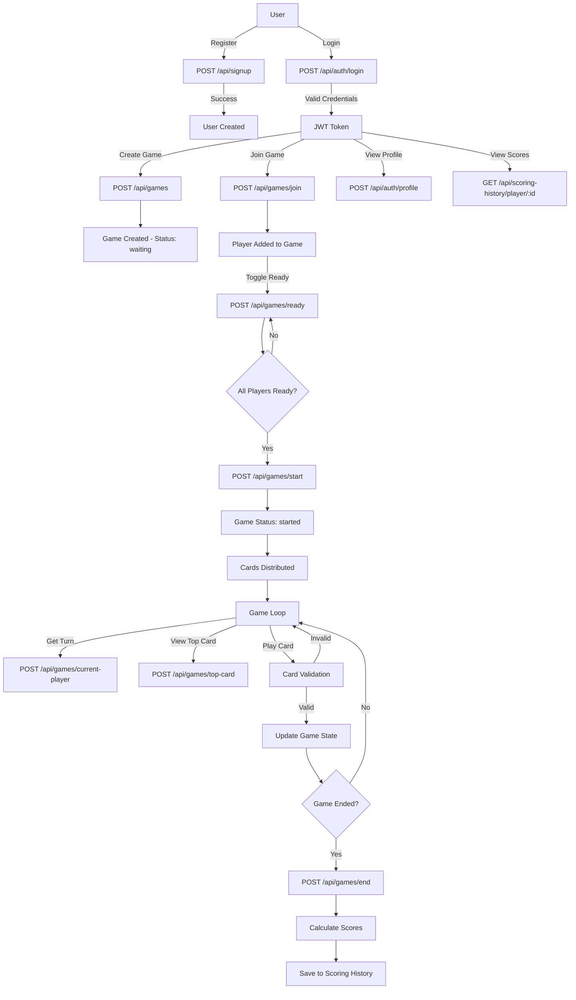

# UNO Game API

A RESTful API for managing UNO card game sessions with player authentication, game state management, and scoring system.

## Application Objective

This application provides a complete backend solution for playing UNO online. It handles player registration, authentication, game creation and management, card operations, and score tracking. Players can create games, join existing games, play cards following UNO rules, and track their scoring history.

---

## Application Flow



---

## API Endpoints

### Authentication
- **POST** `/api/signup` - Register a new user
- **POST** `/api/auth/login` - User login (returns JWT token)
- **POST** `/api/auth/logout` - User logout
- **POST** `/api/auth/profile` - Get user profile

### Players
- **GET** `/api/players` - List all players
- **POST** `/api/players` - Create a new player
- **GET** `/api/players/:id` - Get player by ID
- **PUT** `/api/players/:id` - Update player information
- **DELETE** `/api/players/:id` - Delete a player

### Games
- **POST** `/api/games` 🔒 - Create a new game
- **POST** `/api/games/join` 🔒 - Join an existing game
- **POST** `/api/games/ready` 🔒 - Toggle ready status
- **POST** `/api/games/start` 🔒 - Start the game
- **POST** `/api/games/leave` 🔒 - Leave a game
- **POST** `/api/games/end` 🔒 - End a game
- **POST** `/api/games/state` 🔒 - Get current game state
- **POST** `/api/games/players` 🔒 - Get players in game
- **POST** `/api/games/current-player` 🔒 - Get current player turn
- **POST** `/api/games/top-card` 🔒 - Get top card from discard pile
- **POST** `/api/games/scores` 🔒 - Get current scores
- **GET** `/api/games/:id` - Get game by ID
- **PUT** `/api/games/:id` - Update game
- **DELETE** `/api/games/:id` - Delete game

### Cards
- **POST** `/api/cards` - Create a new card
- **GET** `/api/cards/:id` - Get card by ID
- **PUT** `/api/cards/:id` - Update card
- **DELETE** `/api/cards/:id` - Delete card

### Scoring History
- **GET** `/api/scoring-history` - Get all scoring records
- **GET** `/api/scoring-history/game/:gameId` - Get scores by game
- **GET** `/api/scoring-history/player/:playerId` - Get scores by player
- **POST** `/api/scoring-history` - Create scoring record
- **GET** `/api/scoring-history/:id` - Get scoring record by ID
- **PUT** `/api/scoring-history/:id` - Update scoring record
- **DELETE** `/api/scoring-history/:id` - Delete scoring record

🔒 = Requires authentication (JWT token)

---

## Project Architecture

This project follows a **layered architecture** pattern to ensure separation of concerns and maintainability.

### Main Files

- **[src/server.js](src/server.js)** - Application entry point. Initializes database connection, syncs models, initializes card deck, and starts the Express server
- **[src/app.js](src/app.js)** - Express application configuration. Defines middleware (JSON parsing, error handling) and registers all route modules

### Layers

#### 1. Routes (`src/routes/`)
Entry point for HTTP requests. Maps endpoints to controller methods.

**Files:**
- `signUpRoutes.js` - User registration endpoints
- `loginRoutes.js` - Authentication endpoints
- `playerRoutes.js` - Player CRUD endpoints
- `gameRoutes.js` - Game management endpoints
- `cardRoutes.js` - Card management endpoints
- `scoringHistoryRoutes.js` - Scoring history endpoints

**Responsibility:** Route definition and request delegation

#### 2. Controllers (`src/controllers/`)
Handle HTTP request/response cycle. Parse request data, call services, and format responses.

**Files:**
- `signUpController.js`
- `loginController.js`
- `playerController.js`
- `gameController.js`
- `cardController.js`
- `scoringHistoryController.js`

**Responsibility:** Request handling and response formatting

#### 3. Services (`src/services/`)
Contain business logic and orchestrate operations across repositories. Implement game rules and data validation.

**Files:**
- `signUpService.js`
- `loginService.js`
- `playerService.js`
- `gameService.js` - Implements UNO game logic
- `cardService.js`
- `scoringHistoryService.js`

**Responsibility:** Business logic and rule enforcement

#### 4. Repository (`src/Repository/`)
Data access layer. Abstracts database operations from services.

**Files:**
- `PlayerRepository.js`
- `gameRepository.js`
- `CardRepository.js`
- `GamePlayerRepository.js`

**Responsibility:** Database operations and data persistence

#### 5. Models (`src/models/`)
Sequelize ORM models defining database schema and relationships.

**Files:**
- `player.js` - Player entity
- `game.js` - Game entity with status tracking
- `gamePlayer.js` - Many-to-many relationship between games and players
- `card.js` - Card entity with UNO card properties
- `scoringHistory.js` - Score tracking entity

**Responsibility:** Data structure definition and ORM mapping

#### 6. DTO (Data Transfer Objects) (`src/DTO/`)
Request and response data structures for API communication.

**Structure:**
```
DTO/
├── Request/
│   ├── Cards/
│   ├── Game/
│   ├── GamePlayer/
│   └── Player/
└── Response/
    ├── GameRespondeDTO.js
    └── PlayerResponseDTO.js
```

**Responsibility:** Data validation and transformation

#### 7. Middlewares (`src/middlewares/`)
- **[auth.js](src/middlewares/auth.js)** - JWT authentication middleware for protected routes

**Responsibility:** Request interception and validation

#### 8. Utils (`src/utils/`)
- **[Result.js](src/utils/Result.js)** - Result Monad implementation for functional error handling. Implements Functor (map) and Monad (flatMap) patterns for composable operations

**Responsibility:** Reusable utility functions and patterns

#### 9. Config (`src/config/`)
- `database.js` - Database configuration
- `database.selector.js` - Database instance selector (for testing/production)
- `database.test.js` - Test database configuration

**Responsibility:** Application configuration

### Layer Abstraction Guarantee

**Strict Dependency Flow:**
```
Routes → Controllers → Services → Repository → Models
                         ↓
                        Utils
```

Each layer only depends on the layer directly below it:

1. **Routes** only import Controllers
2. **Controllers** only import Services and DTOs
3. **Services** only import Repositories, Models, and Utils
4. **Repositories** only import Models
5. **Models** have no business logic dependencies

**Benefits:**
- **Testability:** Each layer can be tested independently with mocks
- **Maintainability:** Changes in one layer don't cascade to others
- **Scalability:** Easy to replace implementations (e.g., different databases)
- **Reusability:** Business logic is decoupled from HTTP layer

### How to Run the Project

#### Prerequisites
- Node.js (v14+)
- npm or yarn
- MySQL database (or Docker for containerized setup)

#### Option 1: Run with Docker (Recommended)

1. **Clone the repository**
```bash
git clone <repository-url>
cd RSVDG
```

2. **Configure environment variables**
Copy the example environment file:
```bash
cp .env.example .env
```

Edit `.env` with your settings:
```env
DB_NAME=unodb
DB_USER=root
DB_PASS=your_secure_password
DB_HOST=127.0.0.1
DB_PORT=3307
APP_PORT=3000
JWT_SECRET=your_jwt_secret_key_change_in_production
```

3. **Start MySQL with Docker Compose**
```bash
docker-compose up -d
```

This will:
- Start MySQL 8.0 container
- Expose MySQL on port 3307
- Create persistent volume for data

4. **Install dependencies**
```bash
npm install
```

5. **Start the application**
```bash
npm run dev
```

6. **Access the API**
```
http://localhost:3000/api/
```

#### Option 2: Run without Docker

1. **Clone the repository**
```bash
git clone <repository-url>
cd RSVDG
```

2. **Install MySQL locally**
Ensure MySQL is installed and running on your machine.

3. **Configure environment variables**
Copy and edit `.env`:
```bash
cp .env.example .env
```

Update with your local MySQL settings:
```env
DB_NAME=unodb
DB_USER=your_db_user
DB_PASSWORD=your_db_password
DB_HOST=localhost
DB_PORT=3306
JWT_SECRET=your_jwt_secret_key
APP_PORT=3000
```

4. **Install dependencies**
```bash
npm install
```

5. **Start the development server**
```bash
npm run dev
```

The server will:
- Create the database if it doesn't exist
- Sync all models (create tables)
- Initialize the UNO card deck
- Start listening on port 3000

#### Docker Commands

```bash
# Start containers
docker-compose up -d

# Stop containers
docker-compose down

# View logs
docker-compose logs -f

# Restart containers
docker-compose restart

# Remove containers and volumes
docker-compose down -v
```

#### Available Scripts

- `npm run dev` - Start development server with nodemon (auto-reload)
- `npm test` - Run all tests
- `npm run test:watch` - Run tests in watch mode
- `npm run test:coverage` - Run tests with coverage report

---

## Tests Roundtrip

### Test Coverage

The project implements comprehensive unit testing covering critical layers of the application.

**Current Coverage:** 70.33% (lines)

```
Statements  : 69.16%
Branches    : 39.76%
Functions   : 68.07%
Lines       : 70.33%
```

✅ **Exceeds the 70% coverage requirement**

### Test Implementation

**Test Framework:** Jest  
**Test Location:** `tests/unit/`  
**Total Test Files:** 26

#### Covered Layers

##### 1. **Services** (Primary Focus)
Services contain the business logic and are extensively tested:
- `cardService.test.js` - Card management logic
- `gameService.test.js` - Game flow and rules
- `playerService.monad.test.js` - Player operations with Monad pattern
- `loginService.test.js` - Authentication logic
- `signUpService.test.js` - Registration logic
- `scoringHistoryService.monad.test.js` - Score tracking with Monad pattern

##### 2. **Controllers**
API layer testing:
- `cardController.test.js`
- `gameController.test.js`
- `playerController.test.js`
- `loginController.test.js`
- `signUpController.test.js`
- `scoringHistoryController.test.js`

##### 3. **Models**
Data validation and ORM testing:
- `game.test.js`
- `gamePlayer.model.test.js`
- `player.test.js`
- `card.test.js`

##### 4. **Repositories**
Data access layer:
- `playerRepository.test.js`

##### 5. **Middlewares**
- `auth.middleware.test.js` - JWT authentication
- `auth.test.js`

##### 6. **DTOs**
- `dto.test.js`
- `createPlayerRequestDTO.test.js`

##### 7. **Utils**
- `result.test.js` - Result Monad implementation

##### 8. **Configuration**
- `database.config.test.js`

##### 9. **Integration**
- `app.test.js` - Application setup
- `game_logic.test.js` - Game flow integration
- `player_profile.test.js` - Player operations

### Test Organization

**Test Setup:** `tests/setup.js` and `tests/helpers/setupModels.js`
- Configures SQLite in-memory database for tests
- Initializes models and associations
- Provides clean test environment

### Running Tests

```bash
# Run all tests
npm test

# Run with coverage report
npm run test:coverage

# Watch mode for development
npm run test:watch
```

### Coverage Report

After running `npm run test:coverage`, a detailed HTML report is generated in:
```
coverage/lcov-report/index.html
```

Open this file in a browser to see:
- Line-by-line coverage
- Uncovered branches
- Function coverage details
- File-by-file breakdown

---

## Technologies Used

- **Node.js** - Runtime environment
- **Express.js** - Web framework
- **Sequelize** - ORM for MySQL
- **MySQL** - Production database
- **SQLite** - Test database
- **JWT** - Authentication
- **bcrypt** - Password hashing
- **Jest** - Testing framework
- **Supertest** - HTTP testing
- **Docker** - Containerization (docker-compose.yml)

---

## Project Structure Summary

```
RSVDG/
├── src/
│   ├── app.js              # Express app setup
│   ├── server.js           # Server entry point
│   ├── routes/             # API endpoints
│   ├── controllers/        # Request handlers
│   ├── services/           # Business logic
│   ├── Repository/         # Data access
│   ├── models/             # Database models
│   ├── DTO/                # Data transfer objects
│   ├── middlewares/        # Auth & validation
│   ├── utils/              # Utilities (Result Monad)
│   └── config/             # Configuration
├── tests/
│   ├── unit/               # Unit tests (26 files)
│   ├── setup.js            # Test configuration
│   └── helpers/            # Test utilities
├── docs/                   # Documentation
├── coverage/               # Coverage reports
├── docker-compose.yml      # Docker setup
├── jest.config.js          # Jest configuration
└── package.json            # Dependencies
```

---

## TEAM 1 - Uno Jala
